# Online Retail Transaction Example
The [video](https://1drv.ms/v/s!AhfQkpeGM2gdgv9Qxj5MsS22aOgzNg?e=9d7IJx) of *Presentation.pptx* briefly introduces this data mining processes.  
The [Implementation.pdf](https://github.com/Chen-Huayi/Data-Mining/blob/main/Implementation.pdf) detailedly illustrates how we apply algorithms from data mining in a simple case.  
The source code is in *src* folder.

# Data Mining Algorithms Implementation: An Online Retail Data Set Case
_**Abstract—We applied frequent patter mining algorithms, frequent sequence mining algorithms and clustering algorithms to a real life retail transaction data set, trying to exact some meaningful information. This is a case study of data mining algorithms implementation.**_

_**Keywords—Frequent Pattern, Frequent Sequence, Clustering, Frequent Pattern Tree Algorithm, AprioriAll Algorithm**_

I. INTRODUCTION

Several data mining algorithms are introduced in the introduction to data mining course. We want to apply these classical algorithms to real life data to see what meaningful information can be extracted. In this project, we will implement clustering algorithms, frequent pattern mining algorithms and frequent sequence mining algorithms on our selected real life data set. By combining several algorithms together to mine a data set, we may have a more integrated method to exploit the data.

In the background section, we will briefly introduce our real life data set and implemented algorithms. For every algorithm implemented, firstly we will talk our implementation details, then we will discuss and analyze our findings. Since these two parts are coherent by nature, we will not separate them into two sections. Instead, we will combine our main body and analytical sections into one section to discuss the implementations and findings. Then, in the conclusion section, we will summarize our analysis, address remaining problems and point out possible further researches. Finally, the appendix section provides a list of all our source codes and spreadsheet working paper.

II. BACKGROUND

A. _The Data Set_  
Our data set is a sales record from a United Kingdom based online retail store [1]. This store mainly sells giftware products. This data set is very suitable for case study of data mining algorithms implementation.

B. _The Algorithms_  
We implemented k-means clustering algorithm to cluster customers, frequent pattern tree algorithm to find frequent patterns, and AprioriAll algorithm to find frequent sequences. Our algorithms are mainly based on the course lectures.We also referred to textbooks materials[2][3]and academic papers[4] for technical details of clustering algorithms since few details are discussed in lectures.

C. _Previous Work_  
Our data source also documented relevant papers with the data source. Besides, there is another very similar data set in the data set repository. The only difference with our data set is that data set contains more data, covering longer time period. So, we collected relevant papers documented in these two data sources as our references to see what previous work has done.

Chen et al. [6] used RFM model to select proper attributes for customer, and then grouped customers by these attributes and clustering algorithms. Their team further studied this topic by taking time variables into consideration[7]. R. Singh et al. [9] used this data set to prove the efficiency of a improved sequential mining algorithm, but did not discuss too much about the frequent sequences themselves. L. Ale et al. [8] and R. Webber [5] used this data set in topics other than data mining.

D. Our Work  
So, from the discussion above, we see that no previous work tried to look for products frequent patterns in our data set. Besides, the paper about sequential mining uses this data set as a tool to prove the efficiency of its improved algorithm instead of being interested in the frequent sequences themselves. Thus, our work seems interesting to look for frequent patterns and sequences themselves in the data set. By observing the data set at different angles, we have a more integrated method to exploit the data.

III. MAIN BODY & ANALYTICAL

A. _Clustering_  
Although others have done much work on customer clustering and classification of this data set, we can still have a quick and simple profiling of the customers to gain some insights. Before we dive deeply to analyze products, we will use partitioning method to allocate customers into different clusters. 

1. _Implementation Details_  
   1. _Coordinate System Setting_  
      We use a 2D coordinate system here to locate customers and calculate distances. The X-axis represents the total number of transactions that a customer has, while the Y-axis represents the total sales revenues that a customer contributes. It is easy to calculate these two attributes for all customers by using the built-in functions in spreadsheet. After the calculation, we assign customers to their corresponding positions on the coordinate system.
      
      The logic of the axis setting is that these two attributes are effective to evaluate a customer. Customers with low sales revenues can be assigned low priority for company resources allocation, no matter what the transactions number is. On the other hand, customer with high revenues and high transactions numbers may require different marketing strategies and resources allocation compared to customer with high revenues but low transactions numbers, which are always VIP customers.  
   2. _Algorithm and Codes_  
       K-means clustering is the most famous algorithm for partitioning clusters, and its simplicity and efficiency make it the most widely used of all clustering algorithms. Given a set of data points and a desired number of clusters k, which is specified by the user, k-mean algorithm iteratively divides the data into k clusters based on a certain distance function.
   
       We use k-means in R language to estimate our clusters. Using the customer calculation outcomes mentioned above as input set of data points and applying the build-in function kmeans and fviz_cluster, R language can easily give us a meaningful clustering result.

2. _Discussion and Analysis of Findings_  
   Fig.1 gives a visualization of the clustering result and
   TABLE 1 summarizes the number of points in each cluster.
   Each point represents a customer.  
   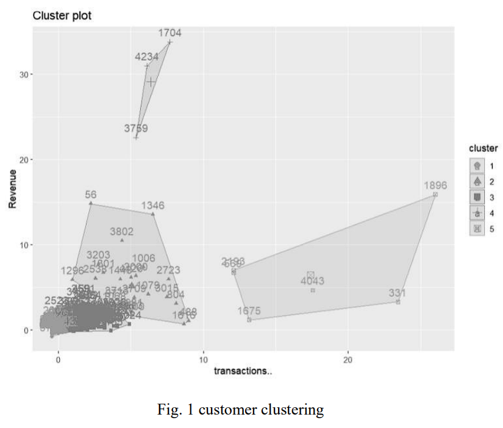
   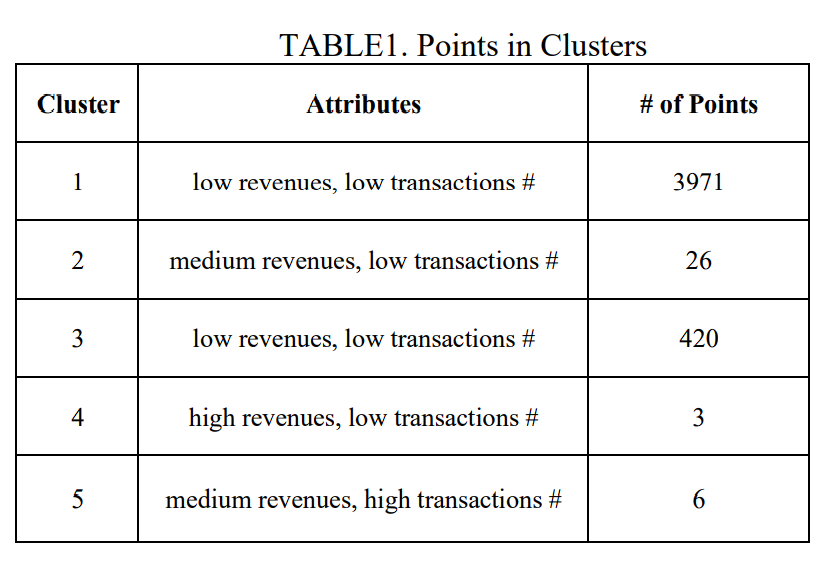
   From the figure and table we can see that most of customers are not quite important. A few customers contribute majority of the sales revenues. These customers deserve further analysis.

B. _Frequent Pattern Mining_  
In this section, we implemented frequent pattern tree algorithm to look for frequent patterns in our data set. We also used open sourced Apriori algorithm for checking calculation. Our source codes and readme files are documented in the appendix. In our context, frequent patterns means which item sets are bought frequently.

1. _Implementation Details_  
   1. _FP Tree_  
      While the Apriori algorithm is doable, another frequent pattern mining algorithm is the FP-growth algorithm. In this project, we analyze and implement the FP-growth algorithm using the transnational data set which contains all the transactions occurring between 01/12/2010 and 09/12/2011 for a UK based non-store online retailer. Fig.2 below shows the process of constructing of the FP-Tree. This is a recursive process to repeatedly add subtree until the transaction is empty. After scanning the data set the first time, each item is copied into a corresponding transaction record list to avoid further
      scan. Within each FP tree node, except the name ID, there are two significant fields. Each tree node contains one parent node to keep track upwards for the frequent items and a homonym node which are the same item name as the tree node itself but belong to a different subtree.  
      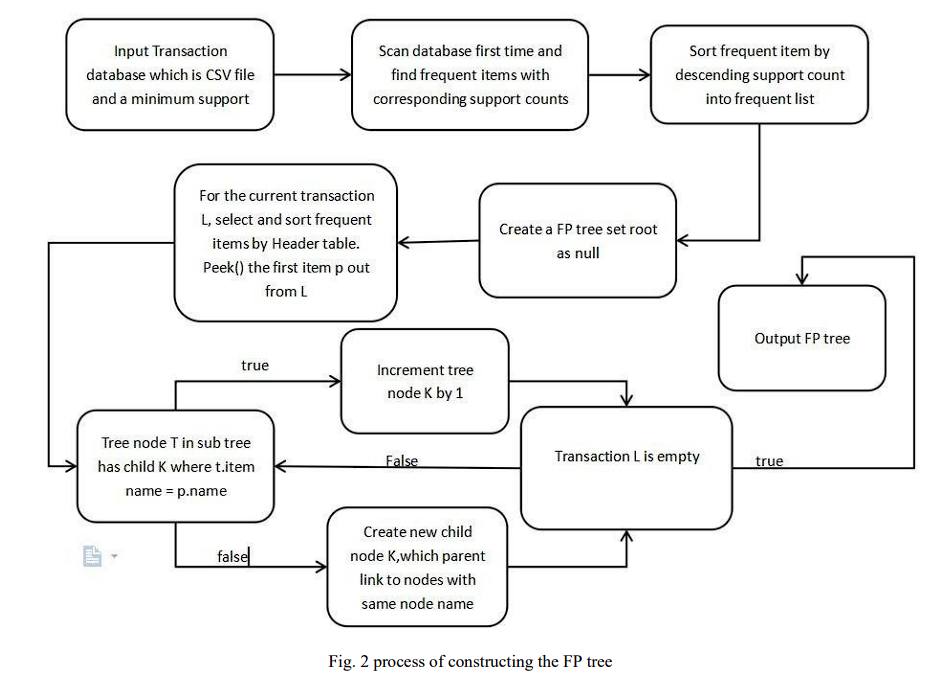
      
   2. _FP mining_ 
    Fig.3 below shows the pseudo-code. Firstly, input the transactions records list D, and set initial input pattern as null. Because the pattern is used to store header node with their frequent items, so initially none of frequent items are generated.  
       
       The pseudo-code shows the process of mining the generated FP tree. The function is recursively called until all frequent item sets with given support are obtained. Besides, the support count of the header table items is updated according to the support count corresponding to the item in the FP. If there is no support count for an item in the FP tree, then the item is a non-frequent item and can be ignored. The FP tree construction process and the pseudo-code show that by this algorithm fewer database scans are needed compared with the Apriori algorithm. The algorithm forms the FP tree by scanning the database once and then uses the resulting tree to find out the associations of frequent patterns.
      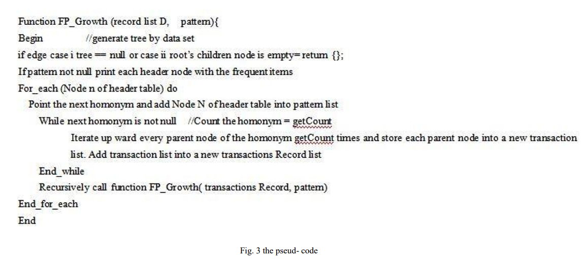
   
    3. _FP Growth Algorithm Example_  
          To illustrate our implementation process, here is an example. The transaction database is shown as TABLE 2, the minimum support threshold is 3. After scanning the database at the first time, order the frequent items as decreasing: {C:4,F:4,A:3,B:3,M:3,P:3} and store the items to Header F1 as shown.  
   
          Calculate the frequent item sets containing the frequent item P, which is the last item in header table. Thus we get the first frequent item:{p:3}. With the same procedure, calculate next homonym backward to its parent we have {c,p:3}. At last, we will obtain all of the frequent item sets {c,f:3}, {c,a:3} {f,a:3}, {c,f,a:3}, {a,m:3}, {c,m:3}, {f,m:3}, {a,c,m:3}, {a,f,m:3}, {c,f,m:3}, {a,c,f,:3}, {c,p:3}. Plus the frequent singleton in Header F1, the result from these small sample data illustrated our mining algorithm.  
   
          Our source codes are written based on the principles above. The findings, which we had after applying the source codes to the real life data set, are discussed and analyzed in the next sub section.
       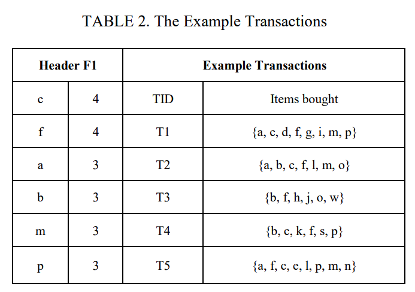
   
   4. _Checking Calculation By Apriori Algorithm_  
        We also used the mlxtend library that comes with python for checking calculation [10]. Below is a brief summary of the process. Codes and readme file are documented in appendix.  
        
        _Data Cleaning_. The algorithm itself requires data frame and minimum support as input parameters. So, before using functions, we need to organize and format the data to some extent. For consistency, we remove the part of the data that is not normal transactions, i.e., the part of invoiceNo that starts with C, and the part that does not contain invoiceNo, in the cleanData function. Only the part of normal transactions is kept as a reference for the data.  
      
      _Data Formatting_. As a frame to the data, we categorize the data by the country attribute. A list of countries was created in the countrySet function. Each piece of data was reformatted into the appropriate format and passed into the list of countries sorted by country name.  
      
      _Data Encoding_. Before finally entering the data, we use an encode function to turn the data into a normalized data frame. For each item, if there is an item, fill in the corresponding invoiceNo with 1, otherwise fill in 0. So, it can be passed as an argument to mlxtend.Apriori.  
      
      _Apply to Algorithm_. After this point, we simply specify the minimum support and pass the arguments into the mlxtend.Apriori function. The data returned by mlxtend.Apriori can then be saved directly as a csv file, maximizing the convenience of visibility.  
   
2. _Discussion and Analysis of Findings_  
   1. _Overall Outcomes_  
        After running our programs and arranging the data, we have the following TABLE 3 to show the overall outcomes. The number 1, 2 and 3 mean how many items in the item sets (cardinality). Other numbers mean how many item sets with certain cardinality meet the minimal support requirement. 
        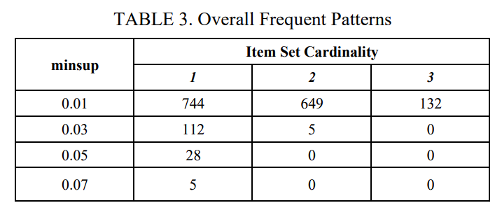
        The minimal support was originally set as 0.05, then nothing was found. Then we decreased the minimal support to 0.03 and finally to 0.01, in the end we could find something. The total number of singleton is 3947. From the table, we can see that even when minimal support is as low as 0.01, the frequent singletons are less than 20% of the total singletons. When the minimal support is set as 0.03 to find frequent pairs, the table shows that there are only 5 pairs meet the requirement. Increasing minimal support or item sets cardinality beyond this range is kind of meaningless. In brief summary, most of products in our data set have very low transaction frequency and connections between products seem to be very weak.
   
	2. _Deeper Studies_  
       Our data set is a sales record. So, not only transaction frequency of a item is important, but also its total sales quantity. TABLE 4 shows the top 10 items by transaction frequency and total sales quantity. From the table, we can see that the overlapping count (overlapping items are marked as red) is only This means that only half of the 10 most frequent singletons are also sold the most quantities, and vice versa. So, in this context, frequent items not necessarily mean popular items.
       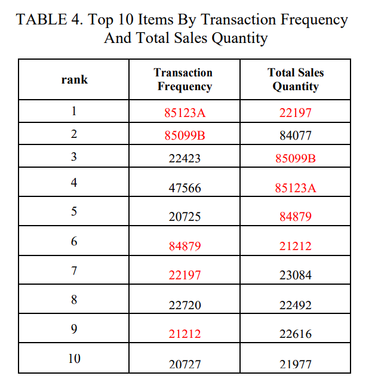
       Transactions in our data set occurred worldwide. And  UK is the major market, counted as more than 90% of the total  transactions. So, we are curious how will the UK frequent patterns table look like. TABLE 5 shows the findings. We find that TABLE 5 is very similar to TABLE 2. Since transactions of UK are dominant in the data set, this finding is not a surprise. It is unnecessary to re-run our codes for 0.01 minimal support here.   
       
       The items in this data set are giftware product. Thus, its  meaningful to see how will the frequent patterns table look  like in the holidays’ sales peak season. We define holidays’  sales peak season as November to next year’s January.  However, since our data set only has records from 01/12/2010  to 09/12/2011, we will examine time frame 2010.12-2011.01 and 2011.11-2011.12 separately. TABLE 6 and TABLE 7 shows our findings.
       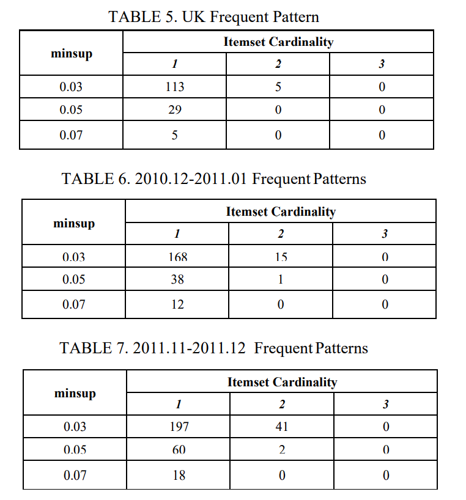
       
       From these two tables, we can see that the frequent item sets are more and connections between items are stronger compared with the other two similar tables. So we may infer that situations are different in holiday seasons compared with ordinary times. Thus, the retailer may need to take distinguishing marketing strategies and inventory management strategies in holiday seasons.
       
       Finally, we select the overall 5 frequent pairs and the frequent pairs in time frame 2011.11-2011.12 to have a look at their interesting rules. The outcomes are shown in TABLE 8 and TABLE 9.
       
       For the overall 5 frequent pairs, we can examine the interesting rules of 10 singletons in the pairs. We can see that most of the confidence levels are more than 50%. Applying the same logic to the 41 frequent pairs in the time frame 2011.11-2011.12, nearly half of singletons have a minimal confidence level of 50%. Thus, although frequent pairs are rare, confidence within the pairs are relatively high. This information may be useful for marketing strategies and inventory management strategies.
       
   3. *Summary*
       In general, majority of the singletons have low  transaction frequencies and frequent item sets with two or  more elements are rare in the data set. However, more  frequent item sets can be found out within some specific time frames. And within the frequent item sets, confidences of interesting rules are relatively high. This meaningful information exacted from the data set is useful for marketing and inventory planning.
       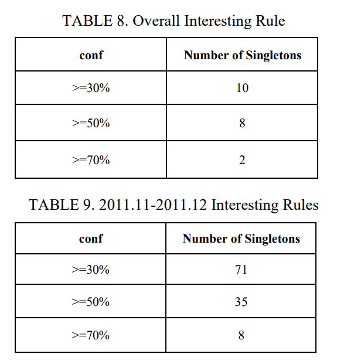

C. *Frequent Sequence Mining*

In this section, we implemented AprioriAll algorithm to  look for frequent sequences in our data set. Our source codes  and readme files are documented in the appendix. The  implementation details section below briefly explain the logic  and process of the codes.

1. *Implementation Details*
    In our online retail example, the time variable plays a significant part in dealing with the order of goods purchased. When receiving a data set, the first step is usually to have adequate preparation of understanding attributes and variables in the data set. The time series data can be either univariate or multivariate. The univariate time variable is a single behavioral attribute associated with each time sequence. Possibly, we focus on univariate in our online retail example by using the order that each customer purchased their products. And then find the frequency of this kind of orders to generate the frequent sequences. Through this data mining procedure, we will explore which commodities are popular with customers,  and which commodities combo are selected most.
    
    1. *Data Cleaning*
         In our data set, customers can be grouped by attributes ‘CustomerID’. Each customers have several transactions to record when and what they buy. Therefore, the critical information columns are ‘Description’, ‘InvoiceDate’, and ‘CustomerID’. Not surprisingly, there are some missing values we need to handle. Since the data are collected by many different collectors of varying levels of ability, we cannot expect them to record data one-hundred percentage of accuracy. So, we use sorting with either ascending order or descending order to find problematic records. We observed  some blank value in ‘CustomerID’ and ‘Description. We think  these records are not normal purchasing transactions, so to  normalize the data set, we decide to remove the all  transactions which at least one of the attributes ‘Description’  or ‘CustomerID’ is blank.
    2. *Noise Removal*
    
         Many real databases are vulnerable to noise, missing  values, and inconsistent data because they are too large and  often come from multiple data sources. Low-quality data will  lead to bad mining results that is meaningless and disturbing  for us to deal with our time series algorithm. Hence, we want  to eliminate both immediate and potential noise as much as  possible. Generally, the removal of short-term fluctuations is a  major noise removal methods. Since our data set is a retailer  database, we realize that each customer may buy many  commodities during several times. Sometimes, purchased  quantities of some products are only small proportions of the  total quantity a customer buys. We will not take such products  into our consideration. The reason is that these goods are not  typical enough to support our time series experiments.  Combine some experience and theories, we set 5% as the  minimum rate to ignore those items whose purchased  quantities percentages are quite low. To do this, we create  findFreqItem function with R program language. This function  will receive each customer’s ID as input, and then find all  transactions’ index that include this customer after scanning  whole database. Next, we get all items’ descriptions through  such index. We calculate the quantity value of each item  purchased by this customer, and append to the output list with  that rate greater than or equal to 5%. As you can imagine, the  data will become smoother and more representative to  illustrate the time series.
    
    3. *Auxiliary functions*
    
         Function isSequent is mainly used to check whether the  given sequence 1 contains sequence 2 in an ordered manner,  and returns true for sequence 1 containing sequence 2,  otherwise returning false. To be specific, for instances here are  two sequences <1 2 3 4> and <1 3>, isSequent (<1 2 3 4>, <1 3>) return true that explain <1 3> is included in sequence <1 2 3 4> in order. However, isSequent (<1 2 3 4>, <3 1>) give us false since the sequence <1 2 3 4> cannot have element 3  before 1. It is obvious that this function can easily determine  whether or not target time sequence is inside the base time  sequence.
    
         Function prunedByFrequency is used to prune the  infrequent item sequence based on AprioriAll algorithm.  Assume a situation when you build the k-frequent item  sequence where k≥2. There are many candidates item  sequences, but some of them may be infrequent because their  subsets are marked as infrequent sequences. By this function,  there is a high probability that we can reduce the cost of  scanning the database by reducing a significant portion of the  infrequent candidate sequences. For example, execute the function prunedByFrequency (L2, C3, 3) where L2 has <1 4>, <4 5>, and a potential candidate goods sequence may be <1 4  5>. We just need to check if the first and last elements are  inside L2 at this point. Obviously, <1 5> is not in L2, thus <1 4  5> should be removed since it is a infrequent item sequence.  On the contrary, if <1 5> is inside, then <1 4 5> can be the  input for the next step of pruning by support rate.

        Function prunedByMinsup is the further step to prune the  current item sequences whose support is less than the minsup.  Similarly, it receives goods sequences as candidates. Then, it  uses isSequent function to count each goods sequence  purchased by all customers. Once its support is greater than or  equal to input minsup (we set the default minsup as 5), this  sequence will be appended to next higher (k+1)-frequent  goods sequences. Finally, the procedures of generate (k+1)- frequent sequence sets are done.
   
   4. *Conducting AprioriAll Algorithm*
   
        At the beginning, we read the data source from  Online_Retail.csv, extracting each unique customer ID from  the column ‘CustomerID’. We do the same thing to extract  different descriptions of goods and map them to their specific  index. Next, we search all sequences from all customers, and  put each customers’ item sequence as string type to variable  allFreqSeq. Now, the following step is to build C1. Since the  primary scan will generate quite a large number of item  indexes, we have to use a pretty high minsup to limit items  that are purchased too few times. We set the 40 as minsup to  get L1 and |L1|=30.
   
        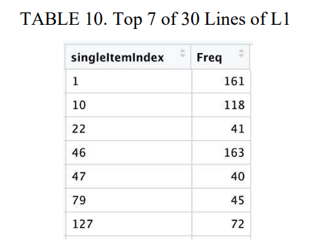
   
        To generate C2, we use two for loops to make all  elements self-join each other, then prune the low support  sequences to build L2 with |L2|=79.
   
        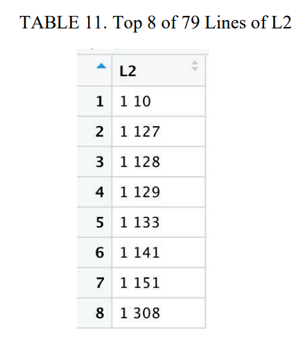
   
        To generate C3, there are slight differences during the  join step. We use two sequences whose last and front element  are equal from the first and second sequences respectively. For  instance, <1 2> and <2 3> to build <1 2 3>, because the two  time sequences need to have a connection point (2) that overlaps. And then prune the infrequent item sequences and  low minsup to generate L3 where |L3|=8.
   
        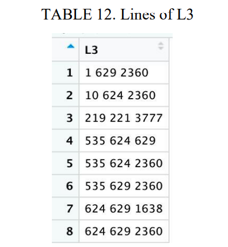
   
        Identically, we generate C4 by merging the two same  connection elements, like <1 2 3> and <2 3 4> to get <1 2 3  4>. After pruning we get L4 with |L4|=1.
   
        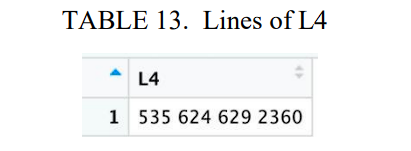
   
        

2) *Discussion and Analysis of Findings*

	In this section, we are trying to apply AprioriAll  algorithm into our selected real life data set. In the beginning,  we set minsup = 5%, which is a limitation number in business  area that represents a kind of data which need to be paid  attention on. However, when we actually applied this minsup  into our AprioriAll algorithm with this data set, we found that  the resulting output is empty, nothing meets the minsup. So,  we changed this dynamic minsup into a fix number 5, which is  a super small number compared to the total number of  transactions. The result is obvious, we found 30 frequent items  in L1, 79 frequent 2-itemset in L2, 8 frequent 3-itemset in L3  and only one 4-itemset are found in L4.
	
	The output of the algorithm is shown as frequent  sequence with their frequency. It is very easy to keep track of  all the details we have found during applying the algorithm for  all kind of further use. What’s more, all the candidate tables  are also saved, so we are always able to look back to it and do  more operations on that whenever needed. Other than that, the  number of minsup are not unchangeable, we can always  change the number of it to find different results. This would be  very practical in real world retail database mining, and it only  takes no more than 20 seconds to get all those results that just  been mentioned above.
	
	The logic for the AprioriAll algorithm we applied to the  database are the same with what we have learnt during the  course. However, since our work processes of mining frequent  pattern and frequent sequence are parallel, we are unable to  base our sequence mining on the pattern mining. Thus, we  only considered singleton here and omitted other frequent  patterns in the sequence. Nevertheless, the coarse findings still  give us some meaningful information, and fortunately frequent  item sets other than singleton are rare and insignificant in the  data set.

IV. CONCLUSION

A. *Summary of Findings*
From the discussion above, we can see that both frequent patterns and frequent sequences are rare in the data set. Meanwhile, by clustering customers, we found that key customers are rare too. This transaction style may be what a retailer should have. Although the frequent pattern and sequence findings may not have too much practical meaning for this data set, the few key customers found out are useful for marketing strategies planning. Besides the findings above, we also found that the majority of single products are rarely bought by customers. This may be a hint for the retailer to further analyze its products. By clustering similar products in groups, the retailer may consider to get rid of unpopular items in each group and keep their popular peers. In business practice, keeping as few as possible stock units is one of the most useful way to reduce supply chain costs.

B. *Data Pretreatment Issue* 
In this retail transactions record, there are some return  transactions. When clustering customers, we took these  transactions into consideration to calculate sales revenues.  When minging frequent patterns and sequences, we ignored  these returns for simplicity. However, this simplification will  not have material impact on our analysis since most return  transactions will not reduce original sales quantity to zero. For  example, a return may reduce original sales quantity from 100  to 90. But for our algorithms, the sales quantity makes no  differences as long as it is bigger than zero. If we use return  transactions to reduce corresponding sales quantity, we will  have accurate outcomes, but the accurate ones will not  materially different from our current outcomes.

C. *Further Study*
From the discussion above, we know that for this data set frequent patterns and sequences are rare based on the minimal support we set. This may be transaction style for all retailers, or just for this specific retailer. If we would like to gain deeper insights, we may further review researches on similar retail transaction data set.  

The second consideration is the quantity attribute of the  transaction. Quantity issue is not talked about in the standard algorithm, and our implementation simply ignored it. However,  by intuition we know that quantity of a transaction is important  in practice. An item bought in 10 transactions with 1 unit per  transaction is not more important than an item bought in 1  transaction with 100 units. The quantity issue is another  direction for further study.

For product clustering, we tried to do it at first, but found  that both stock code and description are irregular. Thus, text  mining or other relevant algorithms may be needed to pretreat  the data before standard clustering algorithms can be applied  to them. Nature language treatment and text mining are out of  scope of topics and algorithms we discussed here, but we give  a brief statement of the idea here for the completeness of our  logic.

V. APPENDIX LIST

A. Clustering folder   
B. FP tree folder  
C. Apriori folder  
D. AprioriAll folder  
E. Spreadsheet working paper folder  
All algorithm implementation folders include the codes,  readme file and necessary input files. All technical details are  documented in readme files. Since our data source is xlsx  format, we used Excel to do some simple calculations. These  working papers are in the corresponding folder.

VI. REFERENCES

+ [1] Dua, D. and Graff, C. (2019). UCI Machine Learning Repository  [http://archive.ics.uci.edu/ml/Online+Retail]. Irvine, CA: University of  California, School of Information and Computer Science. 
+ [2] C. Aggarwal, “Data Mining: The Textbook”, 2015 
+ [3] J. Han, J. Pei, and M. Kamber, “Data Mining: Concepts and Techniques”,  3rd ed, 2011. 
+ [4] Y. Li, and H. Wu, “A Clustering Method Based on K-Means Algorithm”,  Physics Procedia, vol 25, 2012, pp 1104-1109. 
+ [5] R. Webber, “The evolution of direct, data and digital marketing”, Journal  of Direct, Data and Digital Marketing Practice, vol 14, 2013, pp 291-309. 
+ [6] D. Chen, S.L.Sain, and K. Guo, Data mining for the online retail  industry: A case study of RFM model-based customer segmentation  using data mining, Journal of Database Marketing and Customer  Strategy Management, vol. 19, 2012, pp. 197-208. 
+ [7] D. Chen, K. Guo, Bo. Li, “Predicting Customer Profitability  Dynamically over Time: An Experimental Comparative Study”, 24th  Iberoamerican Congress on Pattern Recognition, Havana, Cuba, 28-31  Oct, 2019. 
+ [8] L. Ale, N. Zhang, H. Wu, D. Chen, T. Han, “Online Proactive Caching  in Mobile Edge Computing Using Bidirectional Deep Recurrent Neural  Network”, IEEE Internet of Things Journal, vol 6, 2019, pp 5520-5530. 
+ [9] R. Singh, J. A. Graves, D. A. Talbert, W. Eberle, “Prefix and Suffix  Sequential Pattern Mining”, International Conference on Machine Learning and Data Mining in Pattern Recognition, 2018, pp.296-311. 
+ [10] Sebastian Raschka, "Frequent Itemsets via Apriori Algorithm",  [http://rasbt.github.io/mlxtend/user_guide/frequent_patterns/apriori/],  accessed Nov 2nd, 2021
