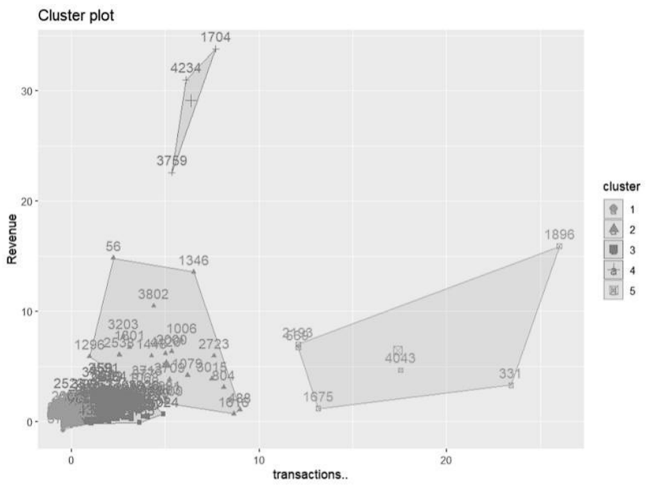
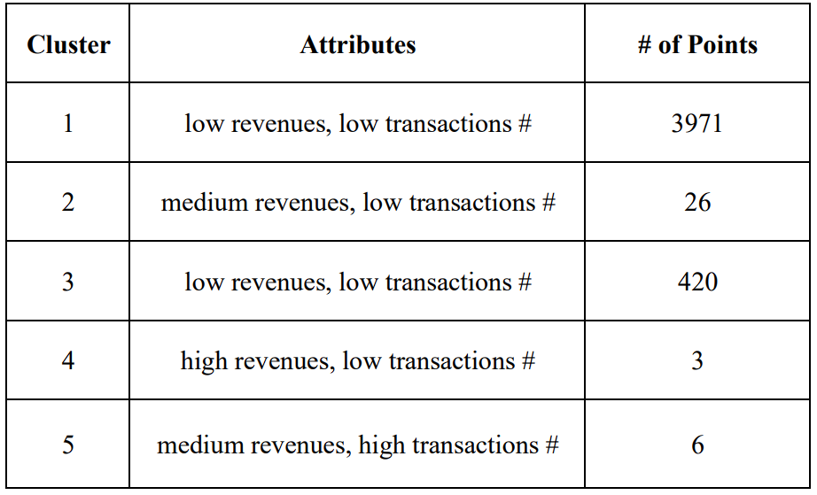
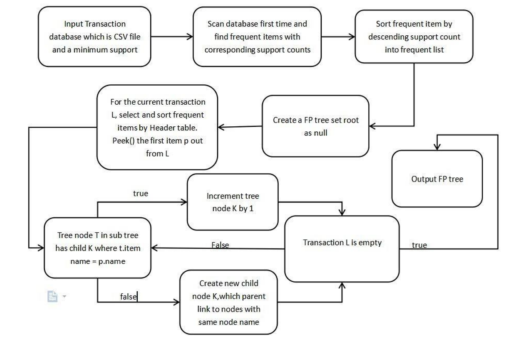
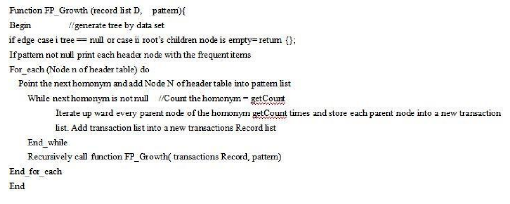
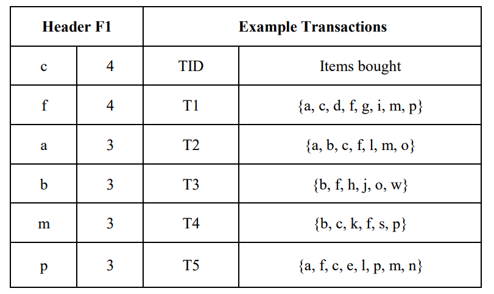
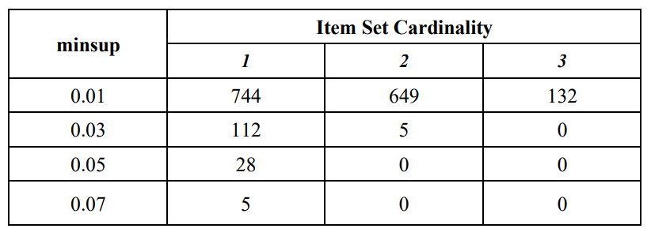

# Online Retail Transaction Example
The [video](https://1drv.ms/v/s!AhfQkpeGM2gdgv9Qxj5MsS22aOgzNg?e=9d7IJx) of *Presentation.pptx* briefly introduces this data mining processes.  
The [Implementation.pdf](https://github.com/Chen-Huayi/Data-Mining/blob/main/Implementation.pdf) detailedly illustrates how we apply algorithms from data mining in a simple case.  
The source code is in *src* folder.

# Data Mining Algorithms Implementation: An Online Retail Data Set Case
_**Abstract—We applied frequent patter mining algorithms, frequent sequence mining 
algorithms and clustering algorithms to a real life retail transaction data set, trying to 
exact some meaningful information. This is a case study of data mining algorithms 
implementation.**_

_**Keywords—Frequent Pattern, Frequent Sequence, Clustering,
Frequent Pattern Tree Algorithm, AprioriAll Algorithm**_

I. INTRODUCTION

Several data mining algorithms are introduced in the
introduction to data mining course. We want to apply these
classical algorithms to real life data to see what meaningful
information can be extracted. In this project, we will
implement clustering algorithms, frequent pattern mining
algorithms and frequent sequence mining algorithms on our
selected real life data set. By combining several algorithms
together to mine a data set, we may have a more integrated
method to exploit the data.

In the background section, we will briefly introduce our
real life data set and implemented algorithms. For every
algorithm implemented, firstly we will talk our implementation
details, then we will discuss and analyze our findings. Since
these two parts are coherent by nature, we will not separate
them into two sections. Instead, we will combine our main
body and analytical sections into one section to discuss the
implementations and findings. Then, in the conclusion section,
we will summarize our analysis, address remaining problems
and point out possible further researches. Finally, the appendix
section provides a list of all our source codes and spreadsheet
working paper.

II. BACKGROUND

A. _The Data Set_  
Our data set is a sales record from a United Kingdom based
online retail store [1]. This store mainly sells giftware products.
This data set is very suitable for case study of data mining
algorithms implementation.

B. _The Algorithms_  
We implemented k-means clustering algorithm to cluster
customers, frequent pattern tree algorithm to find frequent
patterns, and AprioriAll algorithm to find frequent sequences.
Our algorithms are mainly based on the course lectures.We
also referred to textbooks materials[2][3]and academic
papers[4] for technical details of clustering algorithms since
few details are discussed in lectures.

C. _Previous Work_  
Our data source also documented relevant papers with the
data source. Besides, there is another very similar data set in
the data set repository. The only difference with our data set is
that data set contains more data, covering longer time period.
So, we collected relevant papers documented in these two data
sources as our references to see what previous work has done.

Chen et al. [6] used RFM model to select proper
attributes for customer, and then grouped customers by these
attributes and clustering algorithms. Their team further studied
this topic by taking time variables into consideration[7]. R.
Singh et al. [9] used this data set to prove the efficiency of a
improved sequential mining algorithm, but did not discuss too
much about the frequent sequences themselves. L. Ale et al.
[8] and R. Webber [5] used this data set in topics other than
data mining.

D. Our Work  
So, from the discussion above, we see that no previous
work tried to look for products frequent patterns in our data set.
Besides, the paper about sequential mining uses this data set as
a tool to prove the efficiency of its improved algorithm instead
of being interested in the frequent sequences themselves. Thus,
our work seems interesting to look for frequent patterns and
sequences themselves in the data set. By observing the data set
at different angles, we have a more integrated method to
exploit the data.

III. MAIN BODY & ANALYTICAL

A. _Clustering_  
Although others have done much work on customer
clustering and classification of this data set, we can still have a
quick and simple profiling of the customers to gain some
insights. Before we dive deeply to analyze products, we will
use partitioning method to allocate customers into different
clusters.  

1. _Implementation Details_  
   1. _Coordinate System Setting_  
   We use a 2D coordinate system here to locate customers
   and calculate distances. The X-axis represents the total
   number of transactions that a customer has, while the Y-axis
   represents the total sales revenues that a customer contributes.
   It is easy to calculate these two attributes for all customers by
   using the built-in functions in spreadsheet. After the
   calculation, we assign customers to their corresponding
   positions on the coordinate system.
   The logic of the axis setting is that these two attributes
   are effective to evaluate a customer. Customers with low sales
   revenues can be assigned low priority for company resources
   allocation, no matter what the transactions number is. On the
   other hand, customer with high revenues and high transactions
   numbers may require different marketing strategies and
   resources allocation compared to customer with high revenues
   but low transactions numbers, which are always VIP
   customers.  
   2. _Algorithm and Codes_  
   K-means clustering is the most famous algorithm for
   partitioning clusters, and its simplicity and efficiency make it
   the most widely used of all clustering algorithms. Given a set
   of data points and a desired number of clusters k, which is
   specified by the user, k-mean algorithm iteratively divides the
   data into k clusters based on a certain distance function.
   We use k-means in R language to estimate our clusters.
   Using the customer calculation outcomes mentioned above as
   input set of data points and applying the build-in function
   kmeans and fviz_cluster, R language can easily give us a
   meaningful clustering result.

2. _Discussion and Analysis of Findings_  
   Fig.1 gives a visualization of the clustering result and
   TABLE 1 summarizes the number of points in each cluster.
   Each point represents a customer.  
   
   
Fig. 1 customer clustering

   
   
TABLE1. Points in Clusters

    From the figure and table we can see that most of
    customers are not quite important. A few customers contribute
    majority of the sales revenues. These customers deserve
    further analysis.

B. _Frequent Pattern Mining_  
In this section, we implemented frequent pattern tree
algorithm to look for frequent patterns in our data set. We also
used open sourced Apriori algorithm for checking calculation.
Our source codes and readme files are documented in the
appendix. In our context, frequent patterns means which item
sets are bought frequently.

1. _Implementation Details_  
   1. _FP Tree_  
      While the Apriori algorithm is doable, another frequent
      pattern mining algorithm is the FP-growth algorithm. In this
      project, we analyze and implement the FP-growth algorithm
      using the transnational data set which contains all the
      transactions occurring between 01/12/2010 and 09/12/2011 for
      a UK-based non-store online retailer. Fig.2 below shows the
      process of constructing of the FP-Tree. This is a recursive
      process to repeatedly add subtree until the transaction is empty.
      After scanning the data set the first time, each item is copied
      into a corresponding transaction record list to avoid further
      scan. Within each FP tree node, except the name ID, there are
      two significant fields. Each tree node contains one parent node
      to keep track upwards for the frequent items and a homonym
      node which are the same item name as the tree node itself but
      belong to a different subtree.  
      
      
Fig. 2 process of constructing the FP tree

   2. FP mining    
    Fig.3 below shows the pseudo-code. Firstly, input the
    transactions records list D, and set initial input pattern as null.
    Because the pattern is used to store header node with their
    frequent items, so initially none of frequent items are
    generated.
    The pseudo-code shows the process of mining the generated
    FP tree. The function is recursively called until all frequent
    item sets with given support are obtained. Besides, the support
    count of the header table items is updated according to the
    support count corresponding to the item in the FP. If there is
    no support count for an item in the FP tree, then the item is a
    non-frequent item and can be ignored. The FP tree
    construction process and the pseudo-code show that by this
    algorithm fewer database scans are needed compared with the
    Apriori algorithm. The algorithm forms the FP tree by
    scanning the database once and then uses the resulting tree to
    find out the associations of frequent patterns.
      
      
Fig. 3 the pseud- code

    3. _FP Growth Algorithm Example_  
To illustrate our implementation process, here is an example.
The transaction database is shown as TABLE 2, the minimum
support threshold is 3. After scanning the database at the first
time, order the frequent items as decreasing:
{C:4,F:4,A:3,B:3,M:3,P:3} and store the items to Header F1
as shown.  
Calculate the frequent item sets containing the frequent item
P, which is the last item in header table. Thus we get the first
frequent item:{p:3}. With the same procedure, calculate next
homonym backward to its parent we have {c,p:3}. At last, we
will obtain all of the frequent item sets {c,f:3}, {c,a:3} {f,a:3},
{c,f,a:3}, {a,m:3}, {c,m:3}, {f,m:3}, {a,c,m:3}, {a,f,m:3},
{c,f,m:3}, {a,c,f,:3}, {c,p:3}. Plus the frequent singleton in
Header F1, the result from these small sample data illustrated
our mining algorithm.  
Our source codes are written based on the principles above.
The findings, which we had after applying the source codes to
the real life data set, are discussed and analyzed in the next
sub section.
       
      
TABLE 2. The Example Transactions

   4. _Checking Calculation By Apriori Algorithm_  
   We also used the mlxtend library that comes with python
   for checking calculation [10]. Below is a brief summary of the
   process. Codes and readme file are documented in appendix.  
_Data Cleaning_. The algorithm itself requires data frame and
minimum support as input parameters. So, before using
functions, we need to organize and format the data to some
extent. For consistency, we remove the part of the data that is
not normal transactions, i.e., the part of invoiceNo that starts
with C, and the part that does not contain invoiceNo, in the
cleanData function. Only the part of normal transactions is
kept as a reference for the data.  
      _Data Formatting_. As a frame to the data, we categorize the
      data by the country attribute. A list of countries was created in
      the countrySet function. Each piece of data was reformatted
      into the appropriate format and passed into the list of countries
      sorted by country name.  
      _Data Encoding_. Before finally entering the data, we use an
      encode function to turn the data into a normalized data frame.
      For each item, if there is an item, fill in the corresponding
      invoiceNo with 1, otherwise fill in 0. So, it can be passed as an
      argument to mlxtend.Apriori.  
      _Apply to Algorithm_. After this point, we simply specify the
      minimum support and pass the arguments into the
      mlxtend.Apriori function. The data returned by
      mlxtend.Apriori can then be saved directly as a csv file,
      maximizing the convenience of visibility.  

2. _Discussion and Analysis of Findings_  
   1. _Overall Outcomes_  
      After running our programs and arranging the data, we
      have the following TABLE 3 to show the overall outcomes.
      The number 1, 2 and 3 mean how many items in the item sets
      (cardinality). Other numbers mean how many item sets with
      certain cardinality meet the minimal support requirement. 
      The minimal support was originally set as 0.05, then
      nothing was found. Then we decreased the minimal support to
      0.03 and finally to 0.01, in the end we could find something.
      The total number of singleton is 3947. From the table, we can
      see that even when minimal support is as low as 0.01, the
      frequent singletons are less than 20% of the total singletons.
      When the minimal support is set as 0.03 to find frequent pairs,
      the table shows that there are only 5 pairs meet the
      requirement. Increasing minimal support or item sets
      cardinality beyond this range is kind of meaningless. In brief
      summary, most of products in our data set have very low
      transaction frequency and connections between products seem
      to be very weak.
      
      
TABLE 3. Overall Frequent Patterns
  

   2. _Deeper Studies_  
   Our data set is a sales record. So, not only transaction
   frequency of a item is important, but also its total sales
   quantity. TABLE 4 shows the top 10 items by transaction
   frequency and total sales quantity. From the table, we can see
   that the overlapping count (overlapping items are marked as
   red) is only 5. This means that only half of the 10 most
   frequent singletons are also sold the most quantities, and vice
   versa. So, in this context, frequent items not necessarily mean
   popular items.

[//]: # (table 4)

